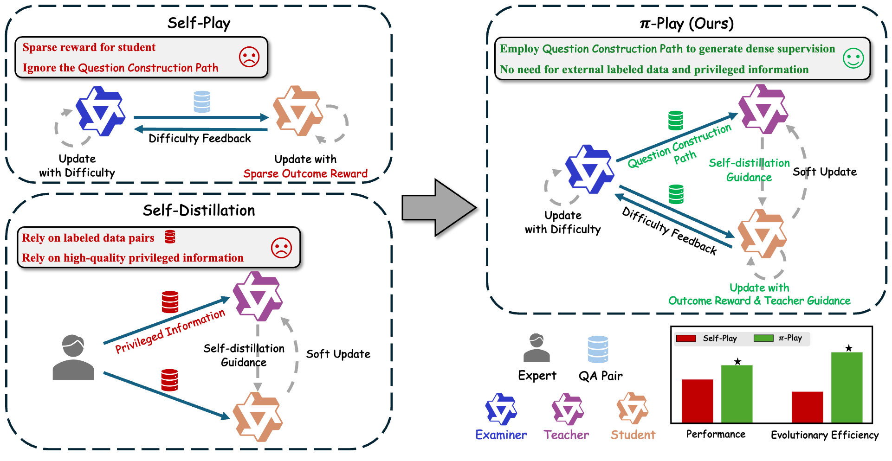
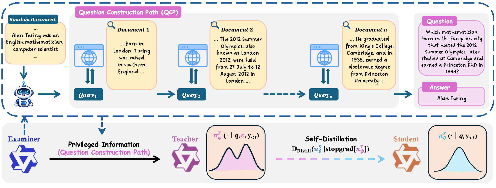

# π-Play: Multi-Agent Self-Play via Privileged Self-Distillation without External Data

[](https://arxiv.org/abs/2604.14054)



**π-Play**, a multi-agent self-evolution framework. See the [paper on arXiv](https://arxiv.org/abs/2604.14054).

> Code will be released soon.

## Abstract
Deep search agents have emerged as a promising paradigm for addressing complex information-seeking tasks, but their training remains challenging due to sparse rewards, weak credit assignment, and limited labeled data. Self-play offers a scalable route to reduce data dependence, but conventional self-play optimizes students only through sparse outcome rewards, leading to low learning efficiency. In this work, we observe that self-play naturally produces a question construction path (QCP) during task generation, an intermediate artifact that captures the reverse solution process. This reveals a new source of privileged information for self-distillation: self-play can itself provide high-quality privileged context for the teacher model in a low-cost and scalable manner, without relying on human feedback or curated privileged information. Leveraging this insight, we propose Privileged Information Self-Play ($\pi$-Play), a multi-agent self-evolution framework. In $\pi$-Play, an examiner generates tasks together with their QCPs, and a teacher model leverages QCP as privileged context to densely supervise a student via self-distillation. This design transforms conventional sparse-reward self-play into a dense-feedback self-evolution loop. Extensive experiments show that data-free $\pi$-Play surpasses fully supervised search agents and improves evolutionary efficiency by 2–3 $\times$ over conventional self-play. 


## TODOs

- [x] Release paper
- [ ] Release code


## Citation

If you find this work useful, please consider citing our paper:

```bibtex
@article{piplay2026,
      title={$\pi$-Play: Multi-Agent Self-Play via Privileged Self-Distillation without External Data}, 
      author={Yaocheng Zhang and Yuanheng Zhu and Wenyue Chong and Songjun Tu and Qichao Zhang and Jiajun Chai and Xiaohan Wang and Wei Lin and Guojun Yin and Dongbin Zhao},
      year={2026},
      journal={arXiv preprint arXiv:2604.14054}, 
}